# Lumma Stealer Traffic Analysis

## Overview

This case study documents the analysis of a packet capture associated with an Emerging Threats alert for **Lumma Stealer Victim Fingerprinting Activity**.

The investigation focused on identifying the affected internal host, attributing the activity to a specific Windows user, identifying the associated domain, and analysing the HTTP traffic used for victim fingerprinting.

The analysis was performed primarily using Wireshark, with passive threat intelligence and Suricata used to enrich and validate the findings.

---

## Key Findings

| Indicator | Finding |
|---|---|
| Affected Host | `10.1.21.58` |
| MAC Address | `00:21:5d:c8:0e:f2` |
| Hostname | `DESKTOP-ES9F3ML` |
| Windows Account | `gwyatt` |
| User | Gabriel Wyatt |
| Domain | `whitepepper.su` |
| External IP | `153.92.1.49` |
| Protocol | HTTP over TCP/80 |
| Activity | Browser and system fingerprinting |
| Custom Detection | Suricata SID `1000001`, Rev `2` |
| Final Validation | 2 fingerprint-submission alerts |

---

## Investigation Objectives

- Identify the infected internal host
- Determine the host MAC address and hostname
- Identify the associated Windows username and full name
- Identify the domain associated with the Lumma Stealer alert
- Analyse the HTTP fingerprinting activity
- Correlate the observed traffic with the IDS alert
- Enrich identified indicators using passive threat intelligence
- Develop and validate a custom Suricata detection rule

---

## Tools & Techniques

- Wireshark
- Suricata
- Emerging Threats IDS signatures
- VirusTotal passive threat intelligence
- TCP/IP protocol analysis
- Windows protocol analysis
  - Kerberos
  - SAMR
  - NBNS
  - LLMNR
- HTTP request and payload analysis
- IOC pivoting and traffic correlation
- Detection engineering and signature tuning

---

## Investigation Context

A Security Operations Center (SOC) alert identified network activity matching the Emerging Threats signature:

**ET MALWARE Lumma Stealer Victim Fingerprinting Activity**

The alert referenced traffic involving the external IP address `153.92.1.49` over TCP port `80`.

The provided packet capture contained traffic from the internal network `10.1.21.0/24`. The first objective was to determine which internal system communicated with the known external indicator.

---

## Initial IOC Pivot

The investigation began by filtering the packet capture using the known IP address and port:

```wireshark
ip.addr == 153.92.1.49 && tcp.port == 80
```

The resulting traffic showed repeated communication between `153.92.1.49` and the internal host `10.1.21.58`.

**Finding:** `10.1.21.58` was identified as the primary host of interest.

---

### Evidence 01 — IOC Pivot and Internal Host Identification

The known external IOC `153.92.1.49:80` was used as the starting point for the investigation.

Filtering the packet capture revealed repeated bidirectional communication with the internal host `10.1.21.58`.

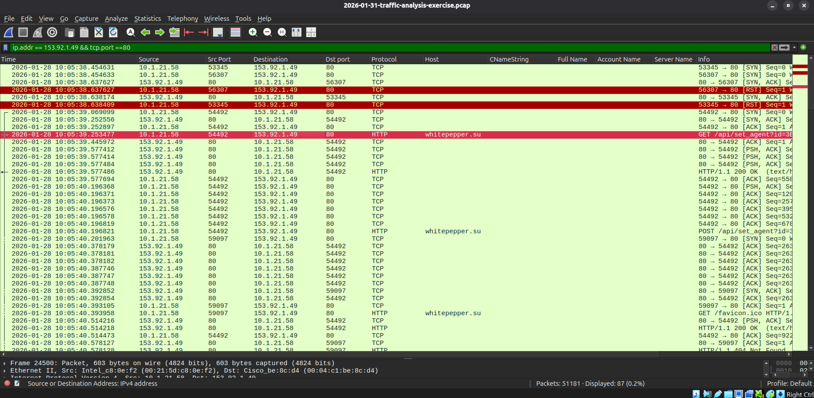

---

### Evidence 02 — MAC Address Attribution

After identifying `10.1.21.58` as the primary host of interest, Ethernet-layer information was examined to associate the IP address with its network interface.

The source MAC address observed for traffic originating from `10.1.21.58` was:

`00:21:5d:c8:0e:f2`

The destination MAC address belonged to the local gateway, while the Layer 3 destination remained the external IP `153.92.1.49`.

This is consistent with normal routed traffic, where Ethernet identifies the next local hop and IP identifies the final network destination.

**Finding:** `10.1.21.58` was associated with MAC address `00:21:5d:c8:0e:f2`.

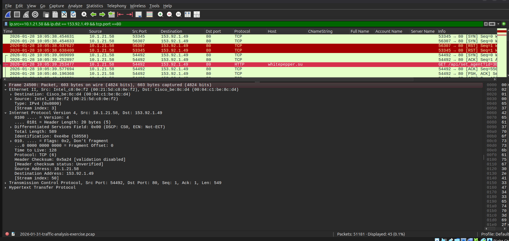

---

### Evidence 03 — Hostname Identification

Local Windows name-resolution traffic was examined to determine the hostname associated with the identified system.

The host `10.1.21.58`, associated with MAC address `00:21:5d:c8:0e:f2`, generated NetBIOS Name Service registration traffic containing:

`DESKTOP-ES9F3ML`

The same hostname was also observed in LLMNR traffic, providing additional correlation between the IP address, network interface, and Windows host identity.

**Finding:** The hostname associated with `10.1.21.58` was `DESKTOP-ES9F3ML`.

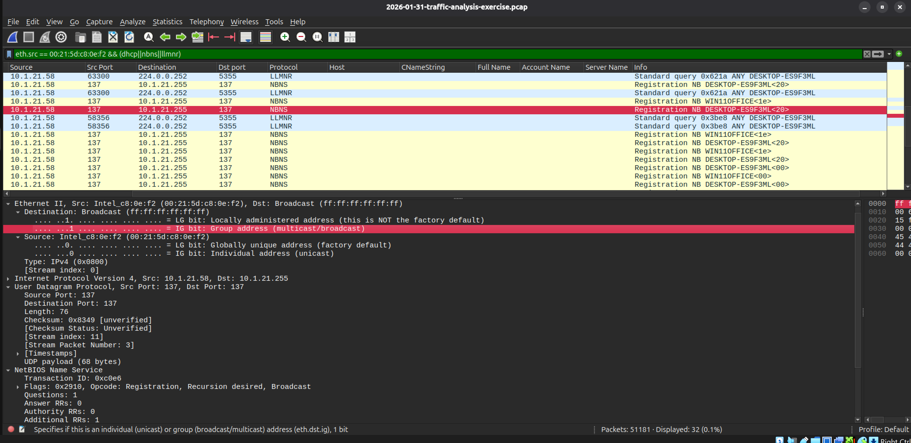

---

### Evidence 04 — Account Attribution via Kerberos

Kerberos authentication traffic between the host of interest and the domain controller was analysed to identify the Windows account associated with the system.

An Authentication Service Request (AS-REQ) originating from `10.1.21.58` to the domain controller `10.1.21.2` contained the Kerberos client principal:

`gwyatt`

The request was associated with the `WIN11OFFICE` realm and also contained the previously identified hostname `DESKTOP-ES9F3ML`, further correlating the host and account information.

**Finding:** The Windows account associated with the host was `gwyatt`.

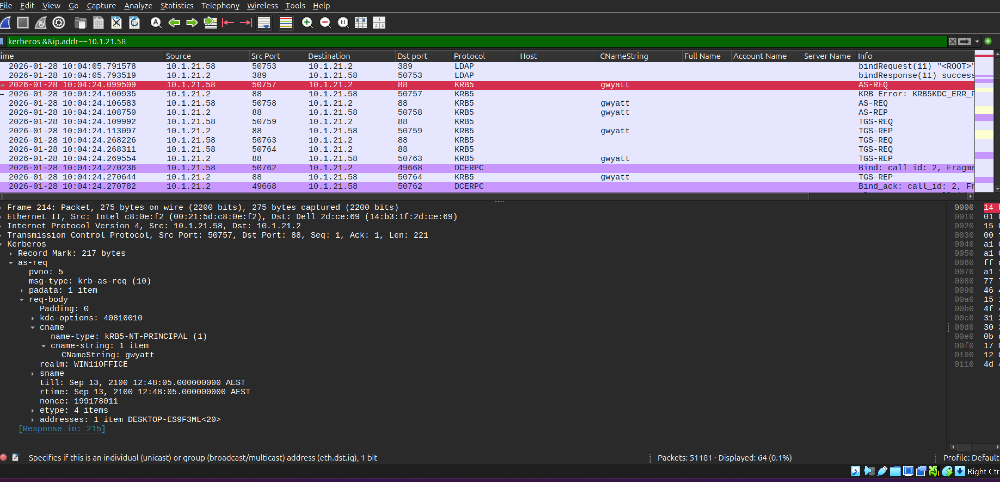

---

### Evidence 05 — Full Name Attribution via SAMR

After identifying the Windows account `gwyatt`, Security Account Manager Remote (SAMR) traffic was analysed to resolve the account to a full user identity.

A `QueryUserInfo` response from the domain controller `10.1.21.2` contained:

- Account Name: `gwyatt`
- Full Name: `Gabriel Wyatt`

This completed the correlation between the affected system and the associated Windows user account.

**Finding:** The account `gwyatt` was associated with the user `Gabriel Wyatt`.

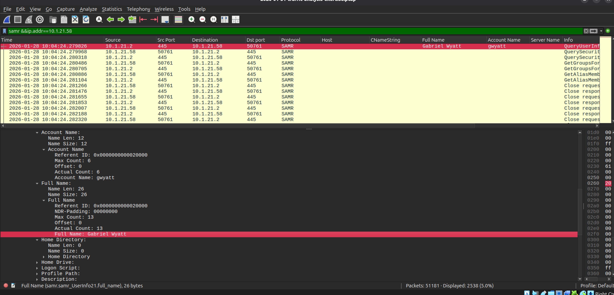

---

### Evidence 06 — C2 Domain Identification

HTTP traffic associated with the external IOC was analysed to identify the domain used during the suspicious communication.

Requests from `10.1.21.58` to `153.92.1.49` contained the HTTP Host header:

`whitepepper.su`

The same traffic also included requests to the `/api/set_agent` endpoint with client-identifying parameters, providing a direct relationship between the external IP address, domain, and observed Lumma-associated activity.

**Finding:** The domain associated with the suspicious traffic to `153.92.1.49` was `whitepepper.su`.

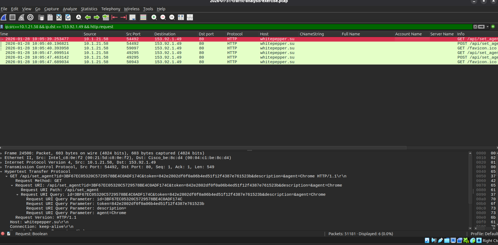

---

### Evidence 07 — Victim Fingerprinting Payload

The suspicious HTTP POST traffic was examined to determine what information the affected host transmitted to the remote infrastructure.

A POST request from `10.1.21.58` to `whitepepper.su` used the endpoint `/api/set_agent` and transmitted approximately `7,975` bytes of URL-encoded data.

The submitted form contained multiple categories of client information, including:

- System and browser information
- WebGL and graphics information
- Canvas fingerprint data
- Network characteristics
- Screen resolution and color depth
- Hardware characteristics
- Language settings
- Installed/common fonts
- WebRTC information
- Audio characteristics
- Browser capabilities and plugins

The traffic also included a browser-style User-Agent identifying Microsoft Edge, consistent with the `agent=Edge` parameter present in the request.

**Finding:** The host transmitted a detailed browser and system fingerprint to the Lumma-associated infrastructure, consistent with the victim fingerprinting behavior described by the IDS alert.

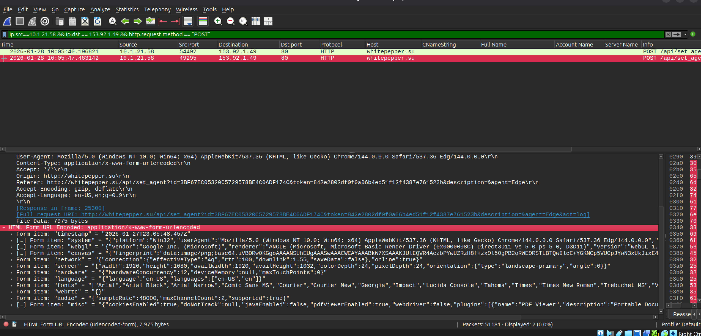

---

### Evidence 08 — Fingerprinting Script Analysis

The HTTP response delivered by `153.92.1.49` contained JavaScript designed to collect detailed characteristics from the client system.

The script queried multiple browser and system properties, including:

- Operating system and browser information
- Language and browser settings
- CPU concurrency and device memory
- WebGL vendor and renderer information
- Canvas rendering characteristics
- Screen and display properties
- Network characteristics
- WebRTC information
- Audio capabilities
- Browser plugins and additional client features

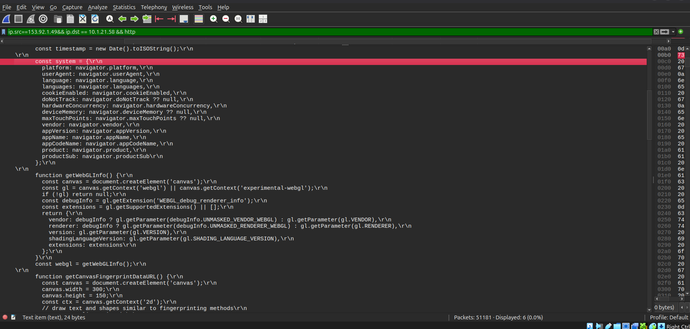

The collected values were then assembled into a `fingerprint` object.

Individual data categories were serialized using `JSON.stringify()` and converted into URL-encoded form data using `URLSearchParams`.

The script subsequently transmitted the fingerprint using an HTTP POST request with the content type:

`application/x-www-form-urlencoded`

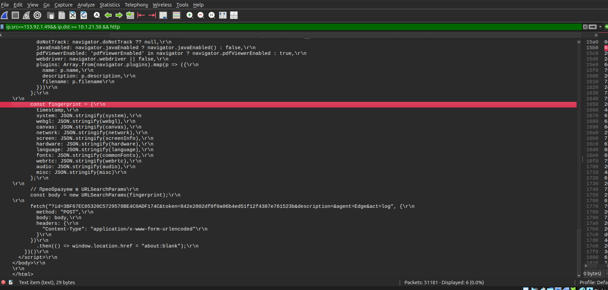

This reconstructed the full fingerprinting workflow observed in the packet capture:

```text
Remote server
      ↓
delivers JavaScript
      ↓
collects client characteristics
      ↓
builds fingerprint object
      ↓
URL-encodes the data
      ↓
HTTP POST to remote infrastructure
```

**Finding:** The remote infrastructure delivered browser-based fingerprinting code that collected detailed client characteristics and transmitted the resulting fingerprint back to the server.

---

### Evidence 09 — IDS Signature Correlation

The observed HTTP request pattern was compared with the Emerging Threats detection logic for:

`ET MALWARE Lumma Stealer Victim Fingerprinting Activity`

The public Suricata rule (SID `2066606`) looks for HTTP requests whose URI begins with:

`/api/set_agent?id=`

and also contains:

- a 32-character client identifier
- `&token=`
- `&description=`
- `&agent=`

The packet capture contained requests matching this structure:

```text
/api/set_agent?id=...&token=...&description=&agent=Edge
```

This provided direct correlation between the packet-level evidence and the IDS alert that initiated the investigation.

**Finding:** The suspicious HTTP request structure observed in the PCAP matched the public Emerging Threats signature logic associated with Lumma Stealer victim fingerprinting activity.

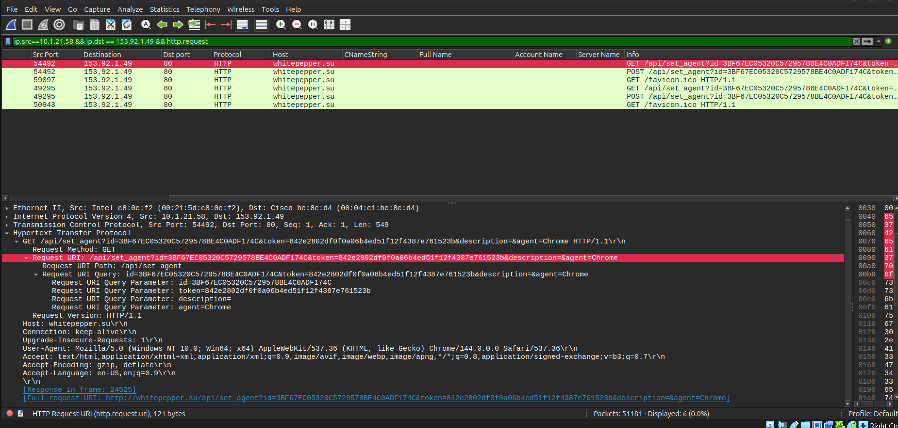

Reference: Emerging Threats rule SID `2066606` — `ET MALWARE Lumma Stealer Victim Fingerprinting Activity`

---

## Attack Timeline

The packet capture was reconstructed chronologically to understand the sequence of communication between the affected host and the Lumma-associated infrastructure.

All times below are presented in UTC.

| Time (UTC) | Event |
|---|---|
| `23:05:38.454631` | First observed TCP connection attempt from `10.1.21.58` to `153.92.1.49:80`. |
| `23:05:39.253477` | The host requested `/api/set_agent` from `whitepepper.su` with `agent=Chrome`. |
| `23:05:39.577486` | The server returned an HTTP 200 response containing the JavaScript fingerprinting code. |
| `23:05:40.196821` | The host transmitted the collected Chrome-related fingerprint using an HTTP POST request. |
| `23:05:47.099514` | A second `/api/set_agent` request was generated with `agent=Edge`. |
| `23:05:47.407929` | The server returned the fingerprinting JavaScript for the Edge-related session. |
| `23:05:47.463142` | The Edge-related fingerprint was transmitted back to the remote infrastructure. |

Two browser-related fingerprinting cycles were observed within approximately eight seconds.

The first cycle completed in approximately 0.94 seconds from the initial `/api/set_agent` request to the fingerprint POST.

The second cycle completed in approximately 0.36 seconds, with only about 55 milliseconds between receipt of the fingerprinting script and transmission of the resulting POST.

**Finding:** The timing and repetition of the requests indicate automated fingerprint collection rather than ordinary interactive browsing.

---

## Passive Threat Intelligence

Passive threat intelligence was used to enrich the external indicators identified during packet analysis.

### Infrastructure Enrichment

The IP address `153.92.1.49` belongs to the `153.92.1.0/24` prefix announced by:

- ASN: `AS47583`
- Organisation: `Hostinger International Limited`
- RIR: `RIPE NCC`

Infrastructure registration and geolocation data were treated as hosting metadata only and not as evidence of the attacker's physical location.

---

### Passive DNS Correlation

VirusTotal passive DNS data showed that `whitepepper.su` resolved to:

`153.92.1.49`

on:

`2026-01-27`

This directly matched the domain-to-IP relationship observed in the packet capture during the incident timeframe.

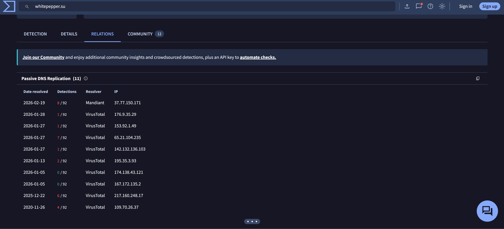

---

### Related File Activity

VirusTotal also showed a large number of files historically communicating with `whitepepper.su` and `153.92.1.49`.

Several Windows executables associated with the infrastructure had high multi-engine detection rates, providing additional context that the infrastructure had been observed in association with suspicious or malicious files.

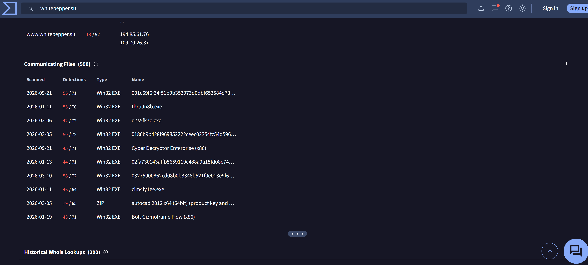

---

### Malware Sample Pivot

A passive pivot from `whitepepper.su` identified a separate Windows executable that had communicated with the same domain.

The sample was not observed during the original incident and was first seen after the incident timeframe; therefore, it was not treated as the malware binary responsible for the compromised host.

However, behavioral analysis of the sample showed communication with `whitepepper.su`, and crowdsourced IDS results included Emerging Threats signatures explicitly identifying the domain as associated with Lumma Stealer command-and-control activity.

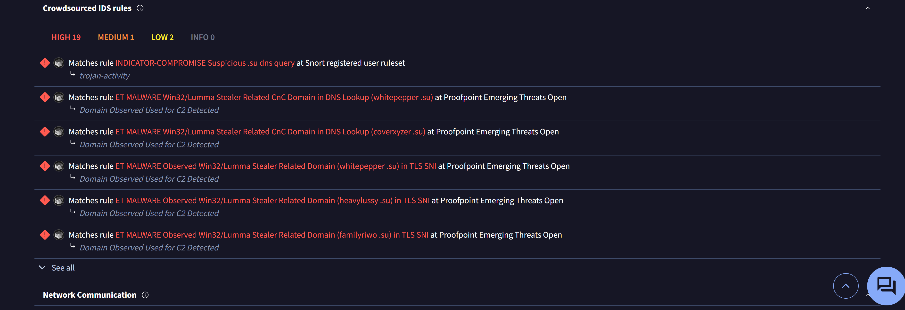

**Assessment:** This sample does not establish the infection source for the investigated host, but it provides independent threat-intelligence corroboration that `whitepepper.su` has been observed in Lumma Stealer-related network activity.

**Finding:** Passive threat intelligence independently corroborated the domain and IP relationship identified in the PCAP and showed additional malicious-file associations with the same infrastructure.

---

## Custom Detection Engineering

Following the network investigation, a custom Suricata signature was developed to detect the observed victim-fingerprinting behavior.

The initial rule matched HTTP requests to `/api/set_agent` containing the parameters `id`, `token`, and `agent`.

### Detection Tuning

The first revision generated **four alerts** because both GET and POST requests matched the detection logic.

Analysis of the HTTP transactions showed that the victim fingerprint data was specifically submitted using POST requests.

The rule was therefore refined to include the HTTP method.

```suricata
alert http $HOME_NET any -> $EXTERNAL_NET any (msg:"LAB Possible Lumma-style victim fingerprinting submission via /api/set_agent"; flow:established,to_server; http.method; content:"POST"; http.uri; content:"/api/set_agent"; startswith; content:"id="; content:"token="; content:"agent="; sid:1000001; rev:2;)
```

### Validation

The revised signature was tested against the original PCAP using Suricata in offline analysis mode.

The final rule generated exactly **two alerts**, corresponding to the two observed fingerprint-submission transactions from the infected host:

- `10.1.21.58:54492 -> 153.92.1.49:80`
- `10.1.21.58:49295 -> 153.92.1.49:80`

This reduced the alert volume from **four events to two more precise detections** while preserving the behavior of interest.

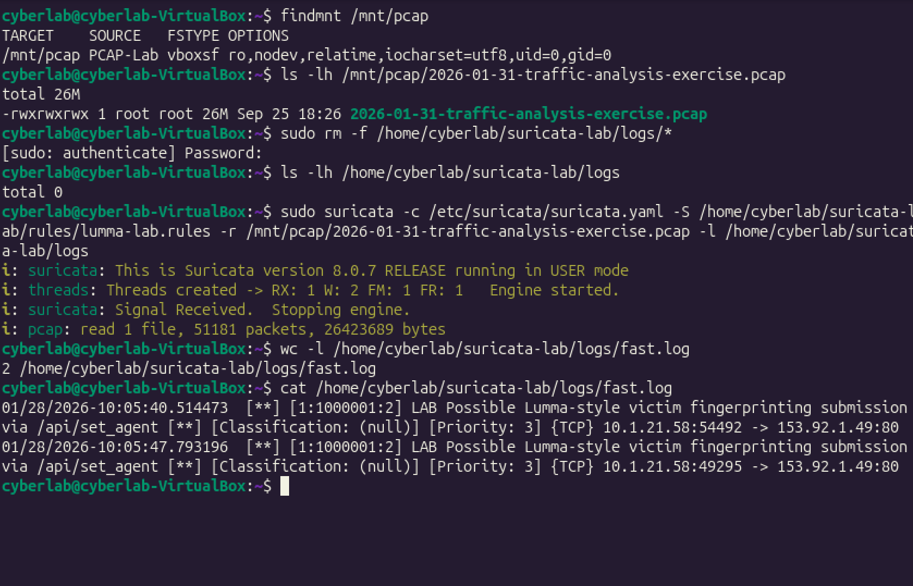

### Detection Result

**Rule SID:** `1000001`  
**Revision:** `2`  
**Alerts generated:** `2`  
**Source host:** `10.1.21.58`  
**Destination:** `153.92.1.49:80`

The result demonstrates the process of moving from packet-level investigation to behavioral detection and subsequent signature tuning.

---

## Skills Demonstrated

- Network traffic analysis with Wireshark
- IOC-driven investigation and traffic correlation
- Ethernet, IP, TCP and HTTP analysis
- Windows host attribution using NBNS and LLMNR
- Windows account attribution using Kerberos
- User identity resolution using SAMR
- HTTP payload and JavaScript analysis
- Browser and system fingerprinting analysis
- Passive threat intelligence enrichment
- IDS signature correlation
- Suricata rule development
- Detection validation and signature tuning
- Evidence-based analytical reporting
